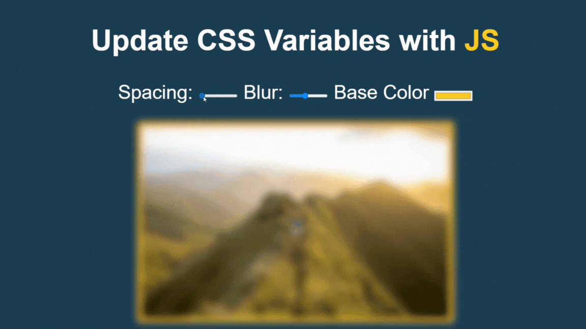

# Dynamic Styler

Dynamic Styler project allows users to dynamically adjust CSS variables using JavaScript, providing visual updates to the styling of HTML elements.

## Features

Users can interact with range inputs and color pickers to adjust CSS variables such as spacing, blur, and color.

## Getting Started

To get started with the project, follow these steps:

1. Clone the repository: `git clone https://github.com/NTracey/JS-Dynamic-Styler.git`
2. Open the `index.html` file in your preferred web browser.
3. Adjust sliders and color pickers setting to see how they affect the page.

## Technologies Used

- HTML5
- CSS3
- JavaScript

## Credits

- This project is inspired by Wes Bos's JavaScript 30 course.
